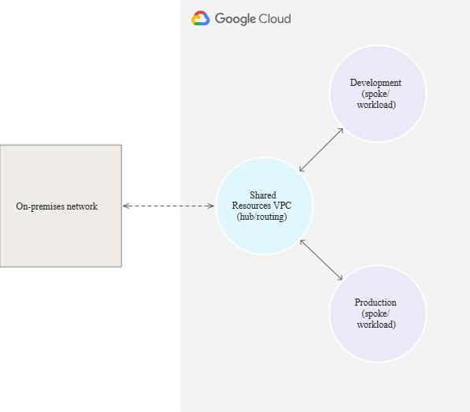

# Cross-Project HA VPN

This setup uses cross-project HA VPN in order to avoid the default Compute Engine SAs which is the ideal "good" security practice. It relies only on the explicit service accounts (https://cloud.google.com/iam/docs/service-account-overview) that Terraform itself creates and manages along with Impersonation of the project account (service account impersonation: https://cloud.google.com/docs/authentication/use-service-account-impersonation)

* Each project (Balerica + Genosha) has its own Terraform service account.
  * Custom IAM roles (e.g. customVpnAccess) are created in each project with only the minimum permissions.
  * Cross-project IAM bindings then allow each SA to use VPN resources in the other project.
  * depends_on ensures that Terraform doesn’t try to bind roles to SAs or apply permissions before the underlying roles/SAs exist.

For Impersonation to work each Project needs a terraform service account with the following Roles assigned:
* Enable Service Account Credentials API in your project.
*  Service Account Token Creator (roles/iam.serviceAccountTokenCreator) IAM role on the service account. More details below

#
#


# Hub and Spoke network architecture
https://cloud.google.com/architecture/deploy-hub-spoke-vpc-network-topology




Hub:

Spokes:
* not available in South America, South Africa:
  * site-to-site data transfer is not supported in South America: "southamerica-east1"

* 1 router per region, per unique ASN relationship.

* Hub-and-spoke - run one router at the hub and let it peer with multiple spokes’ routers — that’s supported and scales well with this confiuration.

* Only add multiple routers in the hub project if you need administrative isolation or different ASN policies per spoke.

#
Each tunnel has:
* Router interface (ip_range = var.*_router_ip_tunnel*)
* Router peer (peer_ip_address = split["/", var.*_router_ip_tunnel*](0))
* Peers use split["/", var.*_router_ip_tunnel0](0) (peer IP only)


NOTE: Split Explanation:  
  peer_ip_address = split["/", var.genosha_router_ip_tunnel0](0)

  var.genosha_router_ip_tunnel0 is defined in your .tfvars like this:
        genosha_router_ip_tunnel0 = "169.254.10.2/30"

  That’s a CIDR string (IP address + subnet mask).But BGP Peers only want the raw IP address, not the mask.

  split("/", var.genosha_router_ip_tunnel0) → ["169.254.10.2", "30"]
    [0] selects the first element → "169.254.10.2"

  This strips off the subnet mask and gives you just the peer IP address. That way, your router interface still uses the full x.x.x.x/30, but the peer uses just the x.x.x.x.

#
#

# All PSKs + ASNs come from .tfvars
ASNs are pulled from balerica_bgp_asn and genosha_bgp_asn

* Router ASN = 65501 (Balerica)
* Peer ASN = 65515 (Genosha)
#

### Full dependency chain: IAM → Gateways → Tunnels → Interfaces → Peers

Terraform follows: IAM ➝ VPN Gateways ➝ Tunnels ➝ Router Interfaces ➝ Router Peers

This will ensure the following:
* Service accounts are created with short account_id = "terraform".
.tfvars overrides (balerica_sa, genosha_sa) can be used if you want pre-existing SAs.
Locals unify the references (local.balerica_sa_email, local.genosha_sa_email).
Custom roles grant minimal VPN permissions.
IAM bindings always reference the correct service account.
depends_on enforces role creation before bindings.

🔹Role of the HA VPN Gateway

* google_compute_ha_vpn_gateway represents the physical HA VPN endpoint in each project/region.
* The tunnels (google_compute_vpn_tunnel) are always anchored to a gateway.
* Without the gateway, Terraform has nowhere to attach the tunnels.
#

🔹 How They Fit in the Config

  Dependency chain:
    * IAM Bindings (google_project_iam_member) → allow cross-project SA usage
    * HA VPN Gateways (google_compute_ha_vpn_gateway) → the actual VPN endpoints
    * Routers (google_compute_router) → BGP-capable routers in each project
    * Tunnels (google_compute_vpn_tunnel) → attach to the gateways and routers
    * Router Interfaces (google_compute_router_interface) → bind tunnels to router IPs
    * Router Peers (google_compute_router_peer) → configure the BGP sessions
    * Terraform doesn’t “import” IAM privileges; it just **relies on your current credentials** to create/update resources.

---


#### How to grant the Terraform service account the **`roles/iam.roleAdmin`** permission directly in Google Cloud IAM

---

## 🔑 Option 1: Using `gcloud` CLI

Run this command to give your Terraform service account `roles/iam.roleAdmin`:

```bash
gcloud projects add-iam-policy-binding taaops \
  --member="serviceAccount:terraform@taaops.iam.gserviceaccount.com" \
  --role="roles/iam.roleAdmin"

```

Or if you want your **user account** (your own email) to have it:

```bash
gcloud projects add-iam-policy-binding taaops \
  --member="user:your.email@example.com" \
  --role="roles/iam.roleAdmin"

```

---

## 🔑 Option 2: Via Google Cloud Console

1. Go to IAM & Admin → IAM.
2. Select the **taaops** project.
3. Find your service account (`terraform@taaops.iam.gserviceaccount.com`) or your own user.
4. Click **Edit principal**.
5. Click **Add role** → Search for **Role Administrator**.
6. Save.

---

## 🔎 Verify Assignment

Once added, you can verify with:

```bash
gcloud projects get-iam-policy taaops \
  --flatten="bindings[].members" \
  --filter="bindings.members:serviceAccount:terraform@taaops.iam.gserviceaccount.com" \
  --format="table(bindings.role)"

```

You should now see:

```
ROLE
roles/iam.roleAdmin

```

#
#
#

---

⚠️ **Security Note**:

`roles/iam.roleAdmin` is powerful — it lets the SA create and update *any* custom role in the project. For production security, restrict this to **Terraform’s dedicated project** only, not globally.

## Terraform Bootstrap code for temporary roles/iam.roleadmin

* IAM bootstraps with RoleAdmin → custom roles → cross-project bindings.
* Gateways wait until bootstrap is finished.
* Tunnels wait until gateways + bindings are finalized.
* Interfaces wait on tunnels.
* Peers wait on interfaces.
* This ensures the mesh only builds once the IAM security foundation is in place, and that elevated privileges are revoked afterwards.

## 🔑 Flow

1. **Bootstrap phase**:

    Terraform gives its SAs `roles/iam.roleAdmin` just long enough to create `customVpnAccess` roles.

2. **Custom roles created**:

    Terraform builds `customVpnAccess` in both projects and applies cross-project bindings.

3. **Tear-down phase**:

    Once bindings are in place, Terraform removes the `roles/iam.roleAdmin` grants.

    → Your SA is left with only the custom role assignments.

---

#### NOTE:

* Removing `roles/iam.roleAdmin` means that **future role edits** will fail unless you re-add it temporarily.
* A safer alternative: keep `roleAdmin` only in **development** projects and strip it out in **production**.
#
#

## Service Account Impersonation

How this works:

* When you run Terraform, the active gcloud user (ADC) is used by default.
* If var.balerica_sa or var.genosha_sa are set, Terraform will impersonate those service accounts using your ADC credentials.
* This avoids ever downloading or storing JSON keys - No JSON files are needed locally.
* In CI/CD, you can do the same with Workload Identity Federation — no keys, just impersonation.
* You authenticate with gcloud auth login (or gcloud auth application-default login).
* Terraform uses your active credentials to impersonate the service accounts in each project.
* If you later rotate or recreate the service account keys, nothing changes in Terraform — it always impersonates.
#
### Security:
No JSON keys lying around on disk.
You can grant temporary impersonation rights to human users or CI/CD identities.

The impersonated SA is what Terraform actually uses to create VPN, routers, IAM, etc.

## Required Permissions

### Google Cloud Console for `roles/iam.roleAdmin`

1. Go to IAM & Admin → IAM.
2. Select the **project**.
3. Find the service account (`terraform@taaops.iam.gserviceaccount.com`) or your own user.
4. Click **Edit principal**.
5. Click **Add role** → Search for **Role Administrator**.
6. Save.

#
## Service Account Impersonation

1. [**Enable the API**](https://console.cloud.google.com/flows/enableapi?apiid=iamcredentials.googleapis.com)
2. Required roles - Service Account Token Creator

    * To get the permission needed to impersonate a service account - [Service Account Token Creator](https://cloud.google.com/iam/docs/roles-permissions/iam#iam.serviceAccountTokenCreator)  (**`roles/iam.serviceAccountTokenCreator`**) 
    
    * IAM role on the service account. For more information about granting roles, see [Manage access to projects, folders, and organizations](https://cloud.google.com/iam/docs/granting-changing-revoking-access).

      1. Go to IAM & Admin → IAM.
      2. Select the **taaops** project.
      3. Find your service account (`terraform@taaops.iam.gserviceaccount.com`) or your own user.
      4. Click **Edit principal**
      5. Click **Add role** → Search for **Service Account Token Creator**

#
## Workflow

#### Sequence: IAM bootstrap → impersonation → customRole → crossBinding sequence

1. **Bootstrap RoleAdmin Bindings**
    * Terraform’s “control SA” (the one you authenticate with) gets `roles/iam.roleAdmin` temporarily in both projects.
    * This allows Terraform to create the **custom VPN roles** and the **cross-project IAM bindings**.
2. **Create Custom VPN Roles**
    * Only possible because RoleAdmin is active.
3. **Create Cross-Project Bindings**
    * Your hub SA gets access to use VPN gateways in spoke projects, and vice versa.
4. **Tear Down RoleAdmin**
    * Once custom roles and cross-project bindings are created, the RoleAdmin binding is removed.
    * Your Terraform SA is left with **least privilege** (only the VPN custom role + any other required roles).
5. **Impersonation**
    * Providers (`google.balerica`, `google.genosha-ops`) are configured to impersonate the SAs defined in `locals.*_sa_email`.
    * No JSON keys are needed.

* Locals handle the **Terraform SAs**.
* `cicd_account` is the **identity running Terraform** (your user locally, CI/CD SA later).
* Bootstrapping (`bootstrap_roleadmin_*`) ensures Terraform SAs can create roles.
* After the VPN roles + cross bindings are applied, you can flip `teardown_roleadmin_*`’s `count` to `1` to strip `roleAdmin` away.

## Dependency Chain Recap

1. **Bootstrap RoleAdmin**

    `google_project_iam_member.bootstrap_roleadmin_*`

2. **Impersonation bindings**

    `google_service_account_iam_member.*_impersonation`

3. **Custom VPN Role**

    `google_project_iam_custom_role.*_vpn_role`

4. **Cross-Project IAM Bindings**

    `google_project_iam_member.allow_*`

5. **Compute Resources**

    HA VPN Gateways → Tunnels → Router Interfaces → Peers

Impersonation Accounts:

* `var.cicd_account` (developer or pipeline SA) gets **impersonation rights** on the Terraform SAs.
* `locals.*_sa_email` (Terraform SAs) are **the accounts Terraform runs as** once impersonation is active.

### CICD account gets rights on Terraform SAs

member = var.cicd_account
#
### Terraform SAs get baseline & custom project roles

* member = "serviceAccount:${local.balerica_sa_email}"
* Locals - use instead of dynamically querying GCP for the SA details

* If you **supply overrides** in `.tfvars` (for example, if your SA name is different), those take precedence.
* If you leave them blank, Terraform builds the default SA email conventionally (Terraform SA named `terraform` in each project).

#
## 🔹 Step-by-Step Bootstrap Flow

### 1. Authenticate as *yourself* (Owner)

Terraform can’t impersonate SAs until you give it permission. So start with your own user account:

```bash
gcloud auth application-default login

```

This creates an **ADC credential** at `~/.config/gcloud/application_default_credentials.json` (or `%APPDATA%\gcloud\application_default_credentials.json` on Windows).

Terraform will use this identity to apply IAM bindings.

---

### 2. Apply only the impersonation bindings

Seed the impersonation chain by letting your Terraform Service Accounts be impersonated:

```bash
terraform init

terraform apply \
  -target=google_service_account_iam_member.balerica_impersonation_token_creator \
  -target=google_service_account_iam_member.balerica_impersonation_sa_user \
  -target=google_service_account_iam_member.genosha_impersonation_token_creator \
  -target=google_service_account_iam_member.genosha_impersonation_sa_user

```

At this point:

* Your CI/CD account (or your Gmail account, if you set `cicd_account = ...`) can mint tokens for the Terraform SAs.
* Terraform SAs themselves don’t yet have project-level powers, but they can now be impersonated.

---

### 3. Verify impersonation works

Check that you can impersonate both project Terraform SAs:

```bash
# Balerica project
gcloud auth print-access-token \
  --impersonate-service-account=terraform@taaops.iam.gserviceaccount.com \
  | head -c 80; echo

# Genosha project
gcloud auth print-access-token \
  --impersonate-service-account=terraform@genosha-ops.iam.gserviceaccount.com \
  | head -c 80; echo

```

If you see a `ya29....` token string, impersonation works.

---

### 4. Switch Terraform providers to impersonation

Since your providers already use:

```hcl
provider "google" {
  alias                      = "balerica"
  impersonate_service_account = local.balerica_sa_email
  ...
}

```

Terraform will automatically run as the impersonated SA next time.

#
Important: make sure you are logged in as your **developer/CI/CD account** (not Owner anymore). For example:

```bash
gcloud auth application-default login   # with your dev/ci account

```

Then confirm Terraform sees impersonation working:

```bash
terraform plan

```

---

### 5. Apply baseline IAM + bootstrap roles

Now impersonation is active, apply the **baseline SA roles + temporary roleAdmin**:

```bash
terraform apply -target=google_project_iam_member.balerica_sa_viewer \
                -target=google_project_iam_member.balerica_sa_network_admin \
                -target=google_project_iam_member.balerica_sa_ncc_admin \
                -target=google_project_iam_member.genosha_sa_viewer \
                -target=google_project_iam_member.genosha_sa_network_admin \
                -target=google_project_iam_member.genosha_sa_ncc_admin \
                -target=google_project_iam_member.bootstrap_roleadmin_balerica \
                -target=google_project_iam_member.bootstrap_roleadmin_genosha

```

---

### 6. Create custom VPN roles

```bash
terraform apply -target=google_project_iam_custom_role.balerica_vpn_role \
                -target=google_project_iam_custom_role.genosha_vpn_role

```

---

### 7. Cross-bindings

```bash
terraform apply -target=google_project_iam_member.allow_balerica_on_genosha \
                -target=google_project_iam_member.allow_genosha_on_balerica

```

---

### 8. Networking (VPCs, routers, VPNs, spokes, etc.)

At this point all IAM dependencies are satisfied. You can now apply everything else in one go:

```bash
terraform apply

```

---

Building the ladder:

1. ADC as Owner.
2. Seed impersonation.
3. Verify impersonation.
4. Run Terraform as impersonated SAs.
5. Apply baseline + bootstrap.
6. Custom roles.
7. Cross-bindings.
8. Networking.

#
## SCRIPTS

#### BASH

##### Manual Bash Boostrap Script

file name: manual_bootstrap.sh
file location: scripts/manual_bootstrap.sh
Run: bash scripts/manual_bootstrap.sh

#

#### Doctor script

Does a self-check for bootstrap_mode, ADC email, etc. before continuing so it will fail/warn early.

file name: doctor_common.sh
file location: scripts/doctor_common.sh:

#

### CICD Scripts

The CI/CD scripts do the following sequences:

* CI/CD scripts self-check first.
* Get warnings locally if you forget to flip bootstrap mode.
* Gives a hard fail if bootstrap_mode = true

#

## CI/CD Script (strict mode)

file name: cicd_bootstrap.sh
file location: scripts/cicd_bootstrap.sh
Runs impersonation mode only
Run it in your pipeline:
```CI=true bash scripts/cicd_bootstrap.sh```

cicd_bash.sh

#

# Makefiles

## Makefile-Driven Workflow version

This is an extended Makefile that bundles the full bootstrap → switch → apply sequence. It is a Makefile-driven script sequence to run all stages with just make bootstrap && make switch && make apply.

file name: dwf.makefile
file location: scripts/makefile/
Run:
```make all```
Or run each phase individually: make bootstrap, make verify, etc.

#

### Basic version

Makefiles have the follow Features built-in:

* Bootstrap / Switch / Reset flow for impersonation setup.
* Teardown for destroying resources.
* Doctor checks:
  * doctor-tools → checks for gcloud, terraform, jq.
  * doctor-light → lists active auth.
  * doctor-debug → verifies ADC client_email matches USER_ACCOUNT.
  * doctor-bootstrap → warns if bootstrap_mode=true.
  * doctor-enforce-bootstrap → hard fail in CI if bootstrap_mode=true.
  * doctor-all → runs everything, colorized banners + final summary.
  * CI awareness → when CI=true, stricter enforcement of bootstrap rules.

#

## 📌 Makefile Cheat Sheet

##### ==============================

#

#### Workflow Targets (bootstrap/Makefile)

##### ------------------------------------------

 make bootstrap            → Apply impersonation bindings (bootstrap_mode=true)
 make switch               → Reminder to flip bootstrap_mode=false & impersonate
 make reset-bootstrap      → Restore Owner role on $(USER_ACCOUNT)
 make teardown             → Destroy all Terraform-managed resources

#

#### Doctor Targets (health checks)

###### ------------------------------------------

 make doctor-tools         → Check required tools (gcloud, terraform, jq)
 make doctor-light         → Show current gcloud authenticated accounts
 make doctor-debug         → Verify ADC client_email matches $(USER_ACCOUNT)
 make doctor-bootstrap     → Warn if bootstrap_mode=true
 make doctor-enforce-bootstrap → Fail hard if bootstrap_mode=true (CI/CD)
 make doctor               → Run doctor-tools + (doctor-bootstrap or enforce-bootstrap)
 make doctor-all           → Run ALL doctor checks (tools, light, debug, bootstrap)

#

#### Terraform Targets (terraform/ directory)

###### ------------------------------------------

make tf-init              → terraform init in terraform/
make tf-plan              → terraform plan in terraform/
make tf-apply             → terraform apply in terraform/
make tf-destroy           → terraform destroy -auto-approve in terraform/

#

#### Convenience

#### ------------------------------------------

make all                  → Run doctor-all then terraform plan

#

###### ==============================
